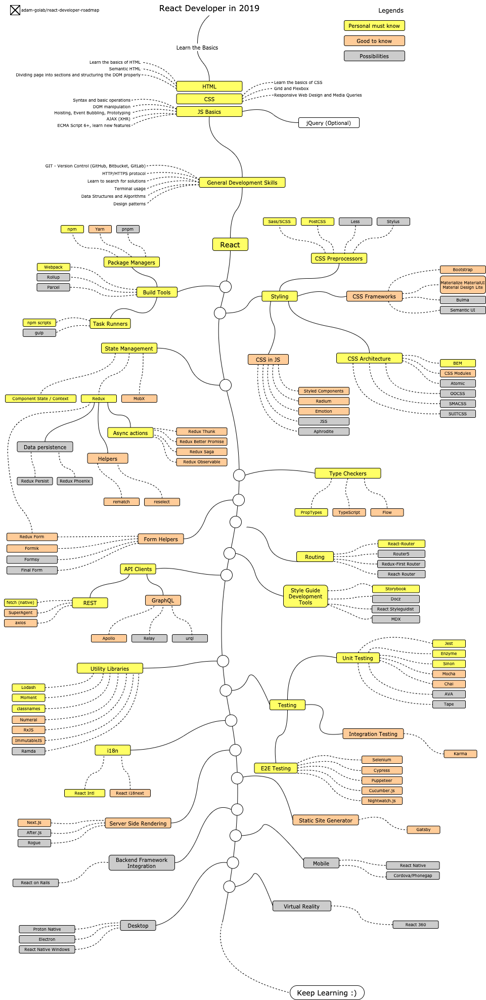

> 2019 সালে প্রতিক্রিয়া বিকাশকারী হওয়ার রোডম্যাপ:

নীচে আপনি একটি চার্ট খুঁজে পেতে পারেন যা আপনি যে পথগুলি নিতে পারেন এবং যে লাইব্রেরিগুলি আপনি প্রতিক্রিয়া বিকাশকারী হতে শিখতে চান তা প্রদর্শন করে৷ আমি এই চার্টটি প্রত্যেকের জন্য একটি টিপ হিসাবে তৈরি করেছি যারা আমাকে জিজ্ঞাসা করে, "একজন প্রতিক্রিয়া বিকাশকারী হিসাবে আমার পরবর্তী কী শিখতে হবে?"

## দাবিত্যাগ

> এই রোডম্যাপের উদ্দেশ্য হল আপনাকে ল্যান্ডস্কেপ সম্পর্কে ধারণা দেওয়া। রোড ম্যাপ আপনাকে গাইড করবে যদি আপনি হিপ এবং ট্রেন্ডি কোনটি বেছে নিতে উত্সাহিত করার পরিবর্তে পরবর্তী কী শিখতে হবে তা নিয়ে বিভ্রান্ত হন। কেন একটি টুল অন্যটির তুলনায় কিছু ক্ষেত্রে ভালোভাবে উপযোগী হবে সে সম্পর্কে আপনার কিছুটা বোধগম্যতা বৃদ্ধি করা উচিত এবং মনে রাখবেন হিপ এবং ট্রেন্ডি সবসময় কাজের জন্য সবচেয়ে উপযুক্ত মানে নয়

## রোডম্যাপ

## সম্পদ

1. মৌলিক
   1. এইচটিএমএল
      - এইচটিএমএল এর মৌলিক বিষয়গুলো জানুন
      - ব্যায়াম হিসেবে কয়েকটি পাতা তৈরি করুন
   2. CSS
      - CSS এর মূল বিষয়গুলো জানুন
      - পূর্ববর্তী ধাপ থেকে স্টাইল পৃষ্ঠা
      - গ্রিড এবং ফ্লেক্সবক্স সহ একটি পৃষ্ঠা তৈরি করুন
   3. জেএস বেসিক
      - বাক্য গঠনের সাথে পরিচিত হন
      - DOM-এ মৌলিক ক্রিয়াকলাপ শিখুন
      - JS (উত্তোলন, ইভেন্ট বুদবুদ, প্রোটোটাইপিং) এর জন্য সাধারণ পদ্ধতি শিখুন
      - কিছু AJAX (XHR) কল করুন
      - নতুন বৈশিষ্ট্য শিখুন (ECMA স্ক্রিপ্ট 6+)
      - উপরন্তু, jQuery লাইব্রেরির সাথে পরিচিত হন
2. সাধারণ উন্নয়ন দক্ষতা
   1. GIT শিখুন, GitHub-এ কয়েকটি রিপোজিটরি তৈরি করুন, আপনার কোড অন্য লোকেদের সাথে শেয়ার করুন
   2. HTTP(S) প্রোটোকল, অনুরোধের পদ্ধতিগুলি জানুন (GET, POST, PUT, PATCH, DELETE, OPTIONS)
   3. Google ব্যবহার করতে ভয় পাবেন না, [Google দিয়ে পাওয়ার সার্চিং](http://www.powersearchingwithgoogle.com/)
   4. টার্মিনালের সাথে পরিচিত হন, আপনার শেল কনফিগার করুন (bash, zsh, fish)
   5. অ্যালগরিদম এবং ডেটা স্ট্রাকচার সম্পর্কে কয়েকটি বই পড়ুন
   6. ডিজাইন প্যাটার্ন সম্পর্কে কয়েকটি বই পড়ুন
3. [অফিসিয়াল ওয়েবসাইটে](https://reactjs.org/tutorial/tutorial.html) প্রতিক্রিয়া জানুন বা কিছু [কোর্স](https://egghead.io/courses/the-beginner-s-guide-to) সম্পূর্ণ করুন - প্রতিক্রিয়া)
4. আপনি যে সরঞ্জামগুলি ব্যবহার করবেন তার সাথে পরিচিত হন৷
   1. প্যাকেজ ম্যানেজার
      - [npm](https://www.npmjs.com/)
      - [সুতা](https://yarnpkg.com/lang/en/)
      - [pnpm](https://pnpm.js.org/)
   2. টাস্ক রানার্স
      - [npm স্ক্রিপ্ট](https://docs.npmjs.com/misc/scripts)
      - [গল্প](https://gulpjs.com/)
   - [ওয়েবপ্যাক](https://webpack.js.org/)
   - [রোলআপ](https://rollupjs.org/guide/en)
   - [পার্সেল](https://parceljs.org/)
5. স্টাইলিং

   1. CSS প্রিপ্রসেসর
      - [Sass/CSS](https://sass-lang.com/)
      - [পোস্টসিএসএস](https://postcss.org/)
      - [কম](http://lesscss.org/)
      - [স্টাইলাস](http://stylus-lang.com/)
   2. CSS ফ্রেমওয়ার্ক
      - [বুটস্ট্র্যাপ](https://getbootstrap.com/)
      - [Materialize](https://materializecss.com/), [Material UI](https://material-ui.com/), [ম্যাটেরিয়াল ডিজাইন লাইট](https://getmdl.io/)
      - [বুলমা](https://bulma.io/)
      - [অর্থবোধক UI](https://semantic-ui.com/)
   3. CSS আর্কিটেকচার
      - [BEM](http://getbem.com/)
      - [CSS মডিউল](https://github.com/css-modules/css-modules)
      - [পরমাণু](https://acss.io/)
      - [OOCSS](https://github.com/stubbornella/oocss/wiki)
      - [SMACSS](https://smacss.com/)
      - [SUITCSS](https://suitcss.github.io/)

6. CSS in JS
   _ [Styled Components](https://www.styled-components.com/)
   _ [Radium](https://formidable.com/open-source/radium/)
   _ [Emotion](https://emotion.sh/)
   _ [JSS](http://cssinjs.org/) \* [Aphrodite](https://github.com/Khan/aphrodite)
7. State Management
   1. [Component State](https://reactjs.org/docs/faq-state.html)/[Context API](https://reactjs.org/docs/context.html)
   2. [Redux](https://redux.js.org/)
      1. Async actions (Side Effects)
         - [Redux Thunk](https://github.com/reduxjs/redux-thunk)
         - [Redux Better Promise](https://github.com/Lukasz-pluszczewski/redux-better-promise)
         - [Redux Saga](https://redux-saga.js.org/)
         - [Redux Observable](https://redux-observable.js.org)
      2. Helpers
         - [Rematch](https://rematch.gitbooks.io/rematch/)
         - [Reselect](https://github.com/reduxjs/reselect)
      3. Data persistence
         - [Redux Persist](https://github.com/rt2zz/redux-persist)
         - [Redux Phoenix](https://github.com/adam-golab/redux-phoenix)
      4. [Redux Form](https://redux-form.com)
   3. [MobX](https://mobx.js.org/)
8. Type Checkers
   - [PropTypes](https://reactjs.org/docs/typechecking-with-proptypes.html)
   - [TypeScript](https://www.typescriptlang.org/)
   - [Flow](https://flow.org/en/)
9. Form Helpers
   - [Redux Form](https://redux-form.com)
   - [Formik](https://github.com/jaredpalmer/formik)
   - [Formsy](https://github.com/formsy/formsy-react)
   - [Final Form](https://github.com/final-form/final-form)
10. Routing
    - [React-Router](https://reacttraining.com/react-router/)
    - [Router5](https://router5.js.org/)
    - [Redux-First Router](https://github.com/faceyspacey/redux-first-router)
    - [Reach Router](https://reach.tech/router/)
11. API Clients
    1. REST
       - [Fetch](https://developer.mozilla.org/en-US/docs/Web/API/Fetch_API)
       - [SuperAgent](https://visionmedia.github.io/superagent/)
       - [axios](https://github.com/axios/axios)
    2. GraphQL
       - [Apollo](https://www.apollographql.com/docs/react/)
       - [Relay](https://facebook.github.io/relay/)
       - [urql](https://github.com/FormidableLabs/urql)
12. Utility Libraries
    - [Lodash](https://lodash.com/)
    - [Moment](https://momentjs.com/)
    - [classnames](https://github.com/JedWatson/classnames)
    - [Numeral](http://numeraljs.com/)
    - [RxJS](http://reactivex.io/)
    - [ImmutableJS](https://facebook.github.io/immutable-js/)
    - [Ramda](https://ramdajs.com/)
13. Testing
    1. Unit Testing
       - [Jest](https://facebook.github.io/jest/)
       - [Enzyme](http://airbnb.io/enzyme/)
       - [Sinon](http://sinonjs.org/)
       - [Mocha](https://mochajs.org/)
       - [Chai](http://www.chaijs.com/)
       - [AVA](https://github.com/avajs/ava)
       - [Tape](https://github.com/substack/tape)
    2. End to End Testing
       - [Selenium](https://www.seleniumhq.org/), [Webdriver](http://webdriver.io/)
       - [Cypress](https://cypress.io/)
       - [Puppeteer](https://pptr.dev/)
       - [Cucumber.js](https://github.com/cucumber/cucumber-js)
       - [Nightwatch.js](http://nightwatchjs.org/)
    3. Integration Testing
       - [Karma](https://karma-runner.github.io/)
14. Internationalization
    - [React Intl](https://github.com/yahoo/react-intl)
    - [React i18next](https://react.i18next.com/)
15. Server Side Rendering
    - [Next.js](https://nextjs.org/)
    - [After.js](https://github.com/jaredpalmer/after.js)
    - [Rogue](https://github.com/alidcastano/rogue.js)
16. Static Site Generator
    - [Gatsby](https://www.gatsbyjs.org/)
17. Backend Framework Integration
    - [React on Rails](https://shakacode.gitbooks.io/react-on-rails/content/)
18. Mobile
    - [React Native](https://facebook.github.io/react-native/)
    - [Cordova](https://cordova.apache.org/)/[Phonegap](https://phonegap.com/)
19. Desktop
    - [Proton Native](https://proton-native.js.org/)
    - [Electron](https://electronjs.org/)
    - [React Native Windows](https://github.com/Microsoft/react-native-windows)
20. Virtual Reality
    - [React 360](https://facebook.github.io/react-360/)

## Wrap Up

If you think the roadmap can be improved, please do open a PR with any updates and submit any issues. Also, I will continue to improve this, so you might want to star this repository to revisit.

## Contribution

The roadmap is built using [Draw.io](https://www.draw.io/). Project file can be found at `/src` directory. To modify it, open draw.io, click **Open Existing Diagram** and choose `xml` file with project. It will open the roadmap for you. Update it, upload and update the images in readme and create a PR (export as png).

- Open a pull request with improvements
- Discuss ideas in issues
- Spread the word

## License

4. JS-এ CSS
   _ [শৈলীকৃত উপাদান](https://www.styled-components.com/)
   _ [রেডিয়াম](https://formidable.com/open-source/radium/)
   _ [আবেগ](https://emotion.sh/)
   _ [জেএসএস](http://cssinjs.org/) \* [অ্যাফ্রোডাইট](https://github.com/Khan/aphrodite)
5. রাষ্ট্রীয় ব্যবস্থাপনা
   1. [কম্পোনেন্ট স্টেট](https://reactjs.org/docs/faq-state.html)/[প্রসঙ্গ API](https://reactjs.org/docs/context.html)
   2. [Redux](https://redux.js.org/)
      1. অ্যাসিঙ্ক অ্যাকশন (পার্শ্ব প্রতিক্রিয়া)
         - [Redux Thunk](https://github.com/reduxjs/redux-thunk)
         - [Redux Better-promise](https://github.com/Lukasz-pluszczewski/redux-better-promise)
         - [Redux Saga](https://redux-saga.js.org/)
         - [Redux অবজারভেবল](https://redux-observable.js.org)
      2. সাহায্যকারী
         - [রিমেচ](https://rematch.gitbooks.io/rematch/)
         - [পুনঃনির্বাচন](https://github.com/reduxjs/reselect)
      3. ডেটা স্থিরতা
         - [Redux Persist](https://github.com/rt2zz/redux-persist)
         - [রেডাক্স ফিনিক্স](https://github.com/adam-golab/redux-phoenix)
      4. [Redux ফর্ম](https://redux-form.com)
   3. [MobX](https://mobx.js.org/)
6. টাইপ চেকার
   - [PropTypes](https://reactjs.org/docs/typechecking-with-proptypes.html)
   - [TypeScript](https://www.typescriptlang.org/)
   - [ফ্লো](https://flow.org/en/)
7. ফর্ম হেল্পার
   - [Redux ফর্ম](https://redux-form.com)
   - [ফর্মিক](https://github.com/jaredpalmer/formik)
   - [ফর্মসি](https://github.com/formsy/formsy-react)
   - [চূড়ান্ত ফর্ম](https://github.com/final-form/final-form)
8. রাউটিং
   - [প্রতিক্রিয়া-রাউটার](https://reacttraining.com/react-router/)
   - [রাউটার৫](https://router5.js.org/)
   - [Redux-প্রথম রাউটার](https://github.com/faceyspacey/redux-first-router)
   - [রাউটারে পৌঁছান](https://reach.tech/router/)
9. API ক্লায়েন্ট
   1. বিশ্রাম
      - [ফেচ](https://developer.mozilla.org/en-US/docs/Web/API/Fetch_API)
      - [সুপারএজেন্ট](https://visionmedia.github.io/superagent/)
      - [axios](https://github.com/axios/axios)
   2. গ্রাফকিউএল
      - [অ্যাপোলো](https://www.apollographql.com/docs/react/)
      - [রিলে](https://facebook.github.io/relay/)
      - [urql](https://github.com/FormidableLabs/urql)
10. ইউটিলিটি লাইব্রেরি
    - [লোদাশ](https://lodash.com/)
    - [মুহূর্ত](https://momentjs.com/)
    - [শ্রেণীর নাম](https://github.com/JedWatson/classnames)
    - [সংখ্যা](http://numeraljs.com/)
    - [RxJS](http://reactivex.io/)
    - [ImmutableJS](https://facebook.github.io/immutable-js/)
    - [রামদা](https://ramdajs.com/)
11. পরীক্ষা
    1. ইউনিট পরীক্ষা
       - [জেস্ট](https://facebook.github.io/jest/)
       - [এনজাইম](http://airbnb.io/enzyme/)
       - [সিনন](http://sinonjs.org/)
       - [মোচা](https://mochajs.org/)
       - [চাই](http://www.chaijs.com/)
       - [AVA](https://github.com/avajs/ava)
       - [টেপ](https://github.com/substack/tape)
    2. এন্ড টু এন্ড টেস্টিং
       - [সেলেনিয়াম](https://www.seleniumhq.org/), [ওয়েবড্রাইভার](http://webdriver.io/)
       - [সাইপ্রেস](https://cypress.io/)
       - [পুতুল](https://pptr.dev/)
       - [Cucumber.js](https://github.com/cucumber/cucumber-js)
       - [Nightwatch.js](http://nightwatchjs.org/)
    3. ইন্টিগ্রেশন টেস্টিং
       - [কর্ম](https://karma-runner.github.io/)
12. আন্তর্জাতিকীকরণ
    - [প্রতিক্রিয়া আন্তর্জাতিক](https://github.com/yahoo/react-intl)
    - [প্রতিক্রিয়া i18next](https://react.i18next.com/)
13. সার্ভার সাইড রেন্ডারিং
    - [Next.js](https://nextjs.org/)
    - [After.js](https://github.com/jaredpalmer/after.js)
    - [রোগ](https://github.com/alidcastano/rogue.js)
14. স্ট্যাটিক সাইট জেনারেটর
    - [গ্যাটসবি](https://www.gatsbyjs.org/)
15. ব্যাকএন্ড ফ্রেমওয়ার্ক ইন্টিগ্রেশন
    - [রেলের উপর প্রতিক্রিয়া](https://shakacode.gitbooks.io/react-on-rails/content/)
16. মোবাইল
    - [প্রতিক্রিয়া নেটিভ](https://facebook.github.io/react-native/)
    - [কর্ডোভা](https://cordova.apache.org/)/[Phonegap](https://phonegap.com/)
17. ডেস্কটপ
    - [প্রোটন নেটিভ](https://proton-native.js.org/)
    - [ইলেক্ট্রন](https://electronjs.org/)
    - [প্রতিক্রিয়া নেটিভ উইন্ডোজ](https://github.com/Microsoft/react-native-windows)
18. ভার্চুয়াল বাস্তবতা
    - [প্রতিক্রিয়া 360](https://facebook.github.io/react-360/)

## শেষ করি

আপনি যদি মনে করেন যে রোডম্যাপটি উন্নত করা যেতে পারে, অনুগ্রহ করে যেকোনো আপডেট সহ একটি পিআর খুলুন এবং কোনো সমস্যা জমা দিন। এছাড়াও, আমি এটিকে আরও উন্নত করতে থাকব, তাই আপনি এই সংগ্রহস্থলটি পুনরায় দেখার জন্য তারকাচিহ্নিত করতে চাইতে পারেন।

## অবদান

রোডম্যাপটি [Draw.io](https://www.draw.io/) ব্যবহার করে তৈরি করা হয়েছে। প্রজেক্ট ফাইল `/src` ডিরেক্টরিতে পাওয়া যাবে। এটি পরিবর্তন করতে, draw.io খুলুন, **এক্সস্টিং ডায়াগ্রাম খুলুন** এ ক্লিক করুন এবং প্রকল্পের সাথে `xml` ফাইল নির্বাচন করুন। এটি আপনার জন্য রোডম্যাপ খুলবে। এটি আপডেট করুন, রিডমিতে ছবিগুলি আপলোড করুন এবং আপডেট করুন এবং একটি PR তৈরি করুন (png হিসাবে রপ্তানি করুন)।

- উন্নতি সহ একটি টান অনুরোধ খুলুন
- সমস্যায় ধারণা নিয়ে আলোচনা করুন
- কথাটি ছড়িয়ে দিন

## লাইসেন্স

