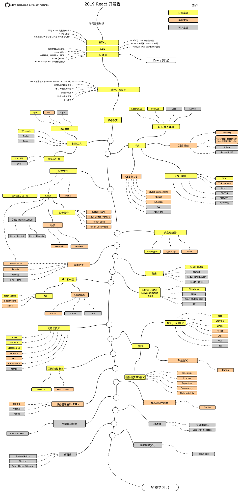

# React 开发者指南

[README in English](README.md)

[README in Japanese](README-JA.md)

[README in Portuguese (Brazil)](README-PTBR.md)

[README in Russian](README-RU.md)

[README in Spanish](README-ES.md)

> 该指南将助你在 2019 成为一名 React 开发者

你可以在下面找到一张图，该图展示了你可以选取的路径及你想学习的库，从而成为一名 React 开发者。“作为 React 开发者，我接下来应该学习什么？”，我把这张图作为建议给每个问过我这一问题的人。

## 免责声明

> 该指南的目的是为了给你心有个大概的轮廓。如果你对接下来要学习的内容感到困惑，指南将指导你而不是鼓励你选择时髦和新颖的东西。
> 你应该逐渐理解为什么一种工具比另一种工具更适合某些情况，并且记住时髦和新颖的东西并不总是意味着最适合这个工作。

## Roadmap

## 资源

1.  基础
    1.  HTML
        - 学习 HTML 基础知识
        - 做几个页面来练习
    2.  CSS
        - 学习 CSS 基础知识
        - 完成上一步的样式页面
        - 使用 grid 布局和 flexbox 布局构建页面
    3.  JS 基础
        - 熟悉语法
        - 学习 DOM 的基本操作
        - 学习 JS 的典型机制（状态提升，事件冒泡，原型）
        - 实现一些 AJAX（XHR）调用
        - 学习新特性 (ECMA Script 6+)
        - 另外，熟悉 jQuery 库
2.  常用开发技能
    1.  学习 GIT 的使用, 在 GitHub 上创建一些仓库, 并和其他人分享你的代码
    2.  掌握 HTTP(S) 协议, 及其请求方法 (GET, POST, PUT, PATCH, DELETE, OPTIONS)
    3.  不要害怕使用 Google, [使用 Google 进行强力搜索](http://www.powersearchingwithgoogle.com/)
    4.  熟悉终端，并配置你的 shell (bash, zsh, fish)
    5.  阅读一些关于算法和数据结构的书籍
    6.  阅读一些关于设计模式的书籍
3.  在[官网](https://reactjs.org/tutorial/tutorial.html)上学习 React 或者完成一些[课程](https://egghead.io/courses/the-beginner-s-guide-to-react)
4.  熟悉你将用到的工具
    1.  包管理器
        - [npm](https://www.npmjs.com/)
        - [yarn](https://yarnpkg.com/lang/en/)
        - [pnpm](https://pnpm.js.org/)
    2.  任务运行器
        - [npm 脚本](https://docs.npmjs.com/misc/scripts)
        - [gulp](https://gulpjs.com/)
    - [Webpack](https://webpack.js.org/)
    - [Rollup](https://rollupjs.org/guide/en)
    - [Parcel](https://parceljs.org/)
5.  样式
    1.  CSS 预处理器
        - [Sass/CSS](https://sass-lang.com/)
        - [PostCSS](https://postcss.org/)
        - [Less](http://lesscss.org/)
        - [Stylus](http://stylus-lang.com/)
    2.  CSS 框架
        - [Bootstrap](https://getbootstrap.com/)
        - [Materialize](https://materializecss.com/), [Material UI](https://material-ui.com/), [Material Design Lite](https://getmdl.io/)
        - [Bulma](https://bulma.io/)
        - [Semantic UI](https://semantic-ui.com/)
    3.  CSS 架构
        - [BEM](http://getbem.com/)
        - [CSS Modules](https://github.com/css-modules/css-modules)
        - [Atomic](https://acss.io/)
        - [OOCSS](https://github.com/stubbornella/oocss/wiki)
        - [SMACSS](https://smacss.com/)
        - [SUITCSS](https://suitcss.github.io/)
    4.  JS 编写 CSS
        - [Styled Components](https://www.styled-components.com/)
        - [Radium](https://formidable.com/open-source/radium/)
        - [Emotion](https://emotion.sh/)
        - [JSS](http://cssinjs.org/)
        - [Aphrodite](https://github.com/Khan/aphrodite)
6.  状态管理
    1.  [组件状态](https://reactjs.org/docs/faq-state.html)/[上下文 API](https://reactjs.org/docs/context.html)
    2.  [Redux](https://redux.js.org/)
        1.  异步操作 (Side Effects)
            - [Redux Thunk](https://github.com/reduxjs/redux-thunk)
            - [Redux Better Promise](https://github.com/Lukasz-pluszczewski/redux-better-promise)
            - [Redux Saga](https://redux-saga.js.org/)
            - [Redux Observable](https://redux-observable.js.org)
        2. 助手
            * [Rematch](https://rematch.gitbooks.io/rematch/)
            * [Reselect](https://github.com/reduxjs/reselect)
        3.  数据持久化
            - [Redux Persist](https://github.com/rt2zz/redux-persist)
            - [Redux Phoenix](https://github.com/adam-golab/redux-phoenix)
        4.  [Redux Form](https://redux-form.com)
    3.  [MobX](https://mobx.js.org/)
7.  类型检查器
    - [PropTypes](https://reactjs.org/docs/typechecking-with-proptypes.html)
    - [TypeScript](https://www.typescriptlang.org/)
    - [Flow](https://flow.org/en/)
8.  表单助手
    - [Redux Form](https://redux-form.com)
    - [Formik](https://github.com/jaredpalmer/formik)
    - [Formsy](https://github.com/formsy/formsy-react)
    - [Final Form](https://github.com/final-form/final-form)
9.  路由
    - [React-Router](https://reacttraining.com/react-router/)
    - [Router5](https://router5.js.org/)
    - [Redux-First Router](https://github.com/faceyspacey/redux-first-router)
    - [Reach Router](https://reach.tech/router/)
10. API 客户端
    1.  REST
        - [Fetch](https://developer.mozilla.org/en-US/docs/Web/API/Fetch_API)
        - [SuperAgent](https://visionmedia.github.io/superagent/)
        - [axios](https://github.com/axios/axios)
    2.  GraphQL
        - [Apollo](https://www.apollographql.com/docs/react/)
        - [Relay](https://facebook.github.io/relay/)
        - [urql](https://github.com/FormidableLabs/urql)
11. 实用工具库
    - [Lodash](https://lodash.com/)
    - [Moment](https://momentjs.com/)
    - [classnames](https://github.com/JedWatson/classnames)
    - [Numeral](http://numeraljs.com/)
    - [RxJS](http://reactivex.io/)
    - [ImmutableJS](https://facebook.github.io/immutable-js/)
    - [Ramda](https://ramdajs.com/)
12. 测试
    1.  单元（Unit）测试
        - [Jest](https://facebook.github.io/jest/)
        - [Enzyme](http://airbnb.io/enzyme/)
        - [Sinon](http://sinonjs.org/)
        - [Mocha](https://mochajs.org/)
        - [Chai](http://www.chaijs.com/)
        - [AVA](https://github.com/avajs/ava)
        - [Tape](https://github.com/substack/tape)
    2.  端到端（E2E）测试
        - [Selenium](https://www.seleniumhq.org/), [Webdriver](http://webdriver.io/)
        - [Cypress](https://cypress.io/)
        - [Puppeteer](https://pptr.dev/)
        - [Cucumber.js](https://github.com/cucumber/cucumber-js)
        - [Nightwatch.js](http://nightwatchjs.org/)
    3.  集成测试
        - [Karma](https://karma-runner.github.io/)
13. 国际化（i18n)
    - [React Intl](https://github.com/yahoo/react-intl)
    - [React i18next](https://react.i18next.com/)
14. 服务端渲染（SSR)
    - [Next.js](https://nextjs.org/)
    - [After.js](https://github.com/jaredpalmer/after.js)
    - [Rogue](https://github.com/alidcastano/rogue.js)
15. 静态网站生成器
    - [Gatsby](https://www.gatsbyjs.org/)
16. 后端集成框架
    - [React on Rails](https://shakacode.gitbooks.io/react-on-rails/content/)
17. 移动端
    - [React Native](https://facebook.github.io/react-native/)
    - [Cordova](https://cordova.apache.org/)/[Phonegap](https://phonegap.com/)
18. 桌面端
    - [Proton Native](https://proton-native.js.org/)
    - [Electron](https://electronjs.org/)
    - [React Native Windows](https://github.com/Microsoft/react-native-windows)
19. 虚拟现实（VR)
    - [React 360](https://facebook.github.io/react-360/)

## 总结

如果你认为指南可以改进，请提交包含任何更新的 PR 并提交任何问题。此外，我将继续改进这个仓库，因此你可以 star 这个仓库以便于重新访问。

## 贡献

该指南是使用[Draw.io](https://www.draw.io/)构建的。项目文件可以在 `/src` 目录中找到。要修改它, 请打开 draw.io, 点击 **Open Existing Diagram** 并选择项目中的 `xml` 文件。它将为你打开指南，更新它，上传和更新自述文件中的图像并创建一个 PR（导出为 png）。

- 改进后提交 PR
- 讨论问题中的想法
- 传播消息

## 版权许可

