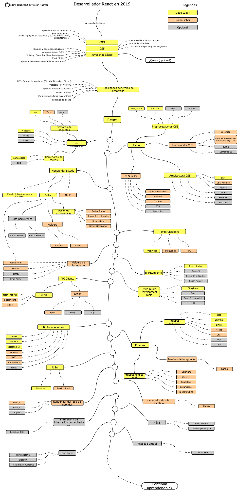

# React Developer Roadmap

[README in Chinese](README-CN.md)

[README in English](README.md)

[README in Japanese](README-JA.md)

[README in Korean](README-KO.md)

[README in Portuguese (Brazil)](README-PTBR.md)

[README in Russian](README-RU.md)

> Roadmap para convertirse en un desarrollador React en 2019:

A continuación, podrás encontrar un gráfico que muestra los diferentes caminos que puedes elegir y las librerías que te deberían de interesarte para convertirte en un desarrollador React. Hice esta tabla como una sugerencia para todos los que me preguntan: "¿Qué debo aprender a continuación para aprender React?"

## Descargo de responsabilidad

   > El propósito de este roadmap es darte una idea sobre el ecosistema. Esto podrá guiarte en caso de que estés confundido sobre qué aprender, en lugar de animarte a elegir lo que es moderno y actual y ya esta. Debes comprender mejor el por qué una herramienta sería más adecuada para algunos casos que otra y recordar que lo que está de moda no siempre es la herramienta más adecuada para el trabajo.

## Roadmap

## Resources

1. Básico
    1. HTML
        * Aprender los conceptos básicos de HTML
        * Hacer unas pocas páginas como ejercicio
    2. CSS
        * Aprender los conceptos básicos de CSS
        * Páginas de estilo del paso anterior
		* Construir una página con Grid y Flexbox
    3. JavaScript Básico
        * Familiarizate con la sintaxis
        * Aprender operaciones básicas dentro del DOM
        * Aprender los mecanismos típicos de JS (Hoisting, Event Bubbling, programación basada en Prototipos)
        * Hacer algunas llamadas AJAX (XHR)
        * Aprender nuevas características (ECMAScript 6+)
        * Además, familiarizate con la libreria jQuery
2. Conceptos Generales de Programación
   * Aprende Git, crea algunos repositorios en GitHub, comparte tú código con otras personas
   * Conoce el protocolo HTTP (S), qué son los métodos de solicitud (GET, POST, PUT, PATCH, DELETE, OPTIONS)
   * No tengas miedo de usar Google, [Power Searching with Google](http://www.powersearchingwithgoogle.com/)
   * Familiarizate con la Terminal (Bash, Consola, como quieras llamarlo), configura tú shell (Bash, ZSH, Fish)
   * Lee algunos libros sobre algoritmos y estructuras de datos
   * Lee algunos libros sobre patrones de diseño
3. Aprende React [Página oficial](https://reactjs.org/tutorial/tutorial.html) o completa algunos [cursos](https://egghead.io/courses/the-beginner-s-guide-to-react)
4. Familiarizate con las herramientas que utilizarás:
    1. Gestores de paquetes (Package Managers)
        * [npm](https://www.npmjs.com/)
        * [yarn](https://yarnpkg.com/lang/en/)
        * [pnpm](https://pnpm.js.org/)
    2. Task Runners
        * [npm scripts](https://docs.npmjs.com/misc/scripts)
        * [gulp](https://gulpjs.com/)
    3. Empaquetadores (bundlers)
       * [Webpack](https://webpack.js.org/)
       * [Rollup](https://rollupjs.org/guide/en)
       * [Parcel](https://parceljs.org/)
5. Estilos
    1. Preprocesadores CSS (CSS Preprocessors)
        * [Sass/CSS](https://sass-lang.com/)
        * [PostCSS](https://postcss.org/)
        * [Less](http://lesscss.org/)
        * [Stylus](http://stylus-lang.com/)
    2. Frameworks CSS
        * [Bootstrap](https://getbootstrap.com/)
        * [Materialize](https://materializecss.com/), [Material UI](https://material-ui.com/), [Material Design Lite](https://getmdl.io/)
        * [Bulma](https://bulma.io/)
        * [Semantic UI](https://semantic-ui.com/)
    3. Arquitectura CSS
        * [BEM](http://getbem.com/)
        * [CSS Modules](https://github.com/css-modules/css-modules)
        * [Atomic](https://acss.io/)
        * [OOCSS](https://github.com/stubbornella/oocss/wiki)
        * [SMACSS](https://smacss.com/)
        * [SUITCSS](https://suitcss.github.io/)
    4. CSS en JS (CssInJS)
        * [Styled Components](https://www.styled-components.com/)
        * [Radium](https://formidable.com/open-source/radium/)
        * [Emotion](https://emotion.sh/)
        * [JSS](http://cssinjs.org/)
        * [Aphrodite](https://github.com/Khan/aphrodite)
6. Manejo del estados (State Managers)
    1. [Component State](https://reactjs.org/docs/faq-state.html)/[Context API](https://reactjs.org/docs/context.html)
    2. [Redux](https://redux.js.org/)
        1. Acciones asincrónicas (Side-Effects, Async Actions)
            * [Redux Thunk](https://github.com/reduxjs/redux-thunk)
            * [Redux Better Promise](https://github.com/Lukasz-pluszczewski/redux-better-promise)
            * [Redux Saga](https://redux-saga.js.org/)
            * [Redux Observable](https://redux-observable.js.org)
        2. Helpers
            * [Rematch](https://rematch.gitbooks.io/rematch/)
            * [Reselect](https://github.com/reduxjs/reselect)
        3. Persistencia de datos
            * [Redux Persist](https://github.com/rt2zz/redux-persist)
            * [Redux Phoenix](https://github.com/adam-golab/redux-phoenix)
        4. [Redux Form](https://redux-form.com)
    3. [MobX](https://mobx.js.org/)
7. Comprobadores de tipos (Typechecking)
    * [PropTypes](https://reactjs.org/docs/typechecking-with-proptypes.html)
    * [TypeScript](https://www.typescriptlang.org/)
    * [Flow](https://flow.org/en/)
8. Helpers de formularios (librerias para formularios)
    * [Redux Form](https://redux-form.com)
    * [Formik](https://github.com/jaredpalmer/formik)
    * [Formsy](https://github.com/formsy/formsy-react)
    * [Final Form](https://github.com/final-form/final-form)
9. Manejo de rutas en el navegador (routing)
    * [React-Router](https://reacttraining.com/react-router/)
    * [Router5](https://router5.js.org/)
    * [Redux-First Router](https://github.com/faceyspacey/redux-first-router)
    * [Reach Router](https://reach.tech/router/)
10. Consumo de API (clientes HTTP)
    1. REST
        * [Fetch](https://developer.mozilla.org/en-US/docs/Web/API/Fetch_API)
        * [SuperAgent](https://visionmedia.github.io/superagent/)
        * [axios](https://github.com/axios/axios)
    2. GraphQL
        * [Apollo](https://www.apollographql.com/docs/react/)
        * [Relay](https://facebook.github.io/relay/)
        * [urql](https://github.com/FormidableLabs/urql)
11. Librerías útiles
    * [Lodash](https://lodash.com/)
    * [Moment](https://momentjs.com/)
    * [classnames](https://github.com/JedWatson/classnames)
    * [Numeral](http://numeraljs.com/)
    * [RxJS](http://reactivex.io/)
    * [ImmutableJS](https://facebook.github.io/immutable-js/)
    * [Ramda](https://ramdajs.com/)
12. Pruebas (Testing)
    1. Pruebas Unitarias (Unit Testing)
        * [Jest](https://facebook.github.io/jest/)
        * [Enzyme](http://airbnb.io/enzyme/)
        * [Sinon](http://sinonjs.org/)
        * [Mocha](https://mochajs.org/)
        * [Chai](http://www.chaijs.com/)
        * [AVA](https://github.com/avajs/ava)
        * [Tape](https://github.com/substack/tape)
    2. Pruebas de extremo a extremo (End To End Testing, E2E)
        * [Selenium](https://www.seleniumhq.org/), [Webdriver](http://webdriver.io/)
        * [Cypress](https://cypress.io/)
        * [Puppeteer](https://pptr.dev/)
        * [Cucumber.js](https://github.com/cucumber/cucumber-js)
        * [Nightwatch.js](http://nightwatchjs.org/)
    3. Pruebas de Integración (Integration Tests)
        * [Karma](https://karma-runner.github.io/)
13. Internacionalización (Int, i18)
    * [React Intl](https://github.com/yahoo/react-intl)
    * [React i18next](https://react.i18next.com/)
14. Render del lado del servidor (Server Side Rendering)
    * [Next.js](https://nextjs.org/)
    * [After.js](https://github.com/jaredpalmer/after.js)
    * [Rogue](https://github.com/alidcastano/rogue.js)
15. Generador de sitio estático (Static Site Generators)
    * [Gatsby](https://www.gatsbyjs.org/)
16. Integración con Framework de Backend
    * [React on Rails](https://shakacode.gitbooks.io/react-on-rails/content/)
17. Móvil
    * [React Native](https://facebook.github.io/react-native/)
    * [Cordova](https://cordova.apache.org/)/[Phonegap](https://phonegap.com/)
18. Escritorio
    * [Proton Native](https://proton-native.js.org/)
    * [Electron](https://electronjs.org/)
    * [React Native Windows](https://github.com/Microsoft/react-native-windows)
19. Realidad virtual
    * [React 360](https://facebook.github.io/react-360/)

## Conclusión

Si crees que se puede mejorar este roadmap, abre un PR con cualquier actualización y envia cualquier problema. Además, continuaré mejorandolo, por lo que es posible que desee darle una estrella a este repositorio para volver a visitarlo.

## Contribución

El diagrama fue elaborado con [Draw.io](https://www.draw.io/). el archivo del proyecto puedes encontrarlo dentro del directorio `/src`. Para modificarlo, abre draw.io, click en **Open Existing Diagram** y elige la opción `xml` file with project. Una vez hecho esto, el diagrama lo podrás ver dentro del programa. actualizalo, súbelo y actualiza la imagen dentro del  README y crea un PR (recuerda que la imagen es un archivo )

* Abrir un pull request con mejoras.
* Discutir ideas en temas (issues).
* Difundir la palabra.

## Licencia

