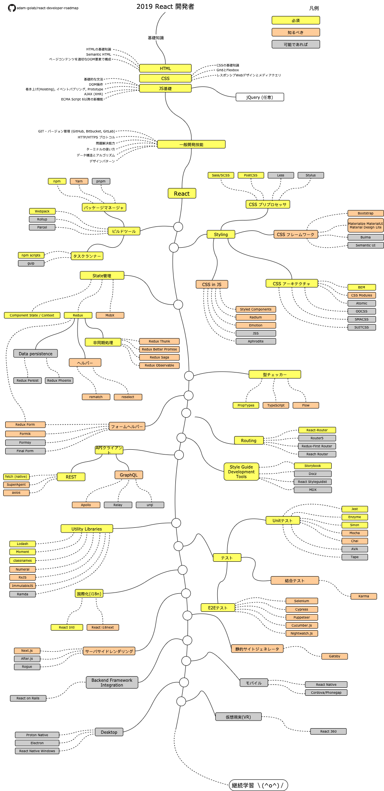

# React 開発者ロードマップ

[README in Chinese](README-CN.md)

[README in English](README.md)

[README in Korean](README-KO.md)

[README in Portuguese (Brazil)](README-PTBR.md)

[README in Russian](README-RU.md)

[README in Spanish](README-ES.md)

> Roadmap to becoming a React developer in 2019:

これはReact開発者になるためにあなたが学ぶべき技術やライブラリを示すチャートです。 このチャートは、「React開発者として次に何を学ぶ必要があるのか」と悩むすべての人へのヒントとして作成しました。

## 免責事項
> このロードマップの目的は、あなたに状況を把握するヒントを与えることです。 あなたが次に何を学ぶべきかについて迷っているときにこのロードマップが導いてくれるでしょう。 あるツールがどのようなケースで他よりも適しているのか、その理由について理解を深める必要があります。また、流行しているものが必ずしも最適であるとは限らないことに注意してください。

## Roadmap

## Resources

1. 基礎知識
    1. HTML
        * HTMLの基礎知識を学ぶ
        * 練習としていくつかページを作成する
    2. CSS
        * CSSの基礎知識を学ぶ
        * 前項で作成したページにCSSを当てる
        * ページを grid 及び flexbox で作成する
    3. JS基礎
        * 構文に詳しくなる
        * DOMの基本操作を学ぶ
        * JSに特徴的なメカニズムを学ぶ (巻き上げ(Hoisting), Event Bubbling, Prototyping)
        * AJAX (XHR) を利用する
        * 新機能を学ぶ (ECMA Script 6以降)
        * jQueryライブラリに詳しくなる
2. 一般開発技能
    1. GITについて学ぶ。GitHubにいくつかレポジトリを作成し他の人と共有してみる
    2. Know HTTP(S) protocol, request methods (GET, POST, PUT, PATCH, DELETE, OPTIONS)
    2. HTTP(S)について知る。リクエストメソッド (GET, POST, PUT, PATCH, DELETE, OPTIONS)
    3. Googleを活用して検索する。[Power Searching with Google](http://www.powersearchingwithgoogle.com/)
    4. ターミナルに慣れる。shell(bash, zsh, fish)の設定をしてみる。
    5. データ構造とアルゴリズムについての本を読む
    6. デザインパターンについての本を読む
3. 公式サイトでReactについて学ぶ [official website](https://reactjs.org/tutorial/tutorial.html) or complete some [courses](https://egghead.io/courses/the-beginner-s-guide-to-react)
4. 利用するツールに詳しくなる
    1. Package Managers
        * [npm](https://www.npmjs.com/)
        * [yarn](https://yarnpkg.com/lang/en/)
        * [pnpm](https://pnpm.js.org/)
    2. Task Runners
        * [npm scripts](https://docs.npmjs.com/misc/scripts)
        * [gulp](https://gulpjs.com/)
    * [Webpack](https://webpack.js.org/)
    * [Rollup](https://rollupjs.org/guide/en)
    * [Parcel](https://parceljs.org/)
5. Styling
    1. CSS Preprocessor
        * [Sass/CSS](https://sass-lang.com/)
        * [PostCSS](https://postcss.org/)
        * [Less](http://lesscss.org/)
        * [Stylus](http://stylus-lang.com/)
    2. CSS Frameworks
        * [Bootstrap](https://getbootstrap.com/)
        * [Materialize](https://materializecss.com/), [Material UI](https://material-ui.com/), [Material Design Lite](https://getmdl.io/)
        * [Bulma](https://bulma.io/)
        * [Semantic UI](https://semantic-ui.com/)
    3. CSS Architecture
        * [BEM](http://getbem.com/)
        * [CSS Modules](https://github.com/css-modules/css-modules)
        * [Atomic](https://acss.io/)
        * [OOCSS](https://github.com/stubbornella/oocss/wiki)
        * [SMACSS](https://smacss.com/)
        * [SUITCSS](https://suitcss.github.io/)
    4. CSS in JS
        * [Styled Components](https://www.styled-components.com/)
        * [Radium](https://formidable.com/open-source/radium/)
        * [Emotion](https://emotion.sh/)
        * [JSS](http://cssinjs.org/)
        * [Aphrodite](https://github.com/Khan/aphrodite)
6. State管理
    1. [Component State](https://reactjs.org/docs/faq-state.html)/[Context API](https://reactjs.org/docs/context.html)
    2. [Redux](https://redux.js.org/)
        1. 非同期処理 (副作用)
            * [Redux Thunk](https://github.com/reduxjs/redux-thunk)
            * [Redux Better Promise](https://github.com/Lukasz-pluszczewski/redux-better-promise)
            * [Redux Saga](https://redux-saga.js.org/)
            * [Redux Observable](https://redux-observable.js.org)
        2. Helpers
            * [Rematch](https://rematch.gitbooks.io/rematch/)
            * [Reselect](https://github.com/reduxjs/reselect)
        3. Data persistence
            * [Redux Persist](https://github.com/rt2zz/redux-persist)
            * [Redux Phoenix](https://github.com/adam-golab/redux-phoenix)
        4. [Redux Form](https://redux-form.com)
    3. [MobX](https://mobx.js.org/)
7. 型チェッカー
    * [PropTypes](https://reactjs.org/docs/typechecking-with-proptypes.html)
    * [TypeScript](https://www.typescriptlang.org/)
    * [Flow](https://flow.org/en/)
8. Form Helpers
    * [Redux Form](https://redux-form.com)
    * [Formik](https://github.com/jaredpalmer/formik)
    * [Formsy](https://github.com/formsy/formsy-react)
    * [Final Form](https://github.com/final-form/final-form)
9. Routing
    * [React-Router](https://reacttraining.com/react-router/)
    * [Router5](https://router5.js.org/)
    * [Redux-First Router](https://github.com/faceyspacey/redux-first-router)
    * [Reach Router](https://reach.tech/router/)
10. API Clients
    1. REST
        * [Fetch](https://developer.mozilla.org/en-US/docs/Web/API/Fetch_API)
        * [SuperAgent](https://visionmedia.github.io/superagent/)
        * [axios](https://github.com/axios/axios)
    2. GraphQL
        * [Apollo](https://www.apollographql.com/docs/react/)
        * [Relay](https://facebook.github.io/relay/)
        * [urql](https://github.com/FormidableLabs/urql)
11. Utility Libraries
    * [Lodash](https://lodash.com/)
    * [Moment](https://momentjs.com/)
    * [classnames](https://github.com/JedWatson/classnames)
    * [Numeral](http://numeraljs.com/)
    * [RxJS](http://reactivex.io/)
    * [ImmutableJS](https://facebook.github.io/immutable-js/)
    * [Ramda](https://ramdajs.com/)
12. Testing
    1. Unit Testing
        * [Jest](https://facebook.github.io/jest/)
        * [Enzyme](http://airbnb.io/enzyme/)
        * [Sinon](http://sinonjs.org/)
        * [Mocha](https://mochajs.org/)
        * [Chai](http://www.chaijs.com/)
        * [AVA](https://github.com/avajs/ava)
        * [Tape](https://github.com/substack/tape)
    2. End to End Testing
        * [Selenium](https://www.seleniumhq.org/), [Webdriver](http://webdriver.io/)
        * [Cypress](https://cypress.io/)
        * [Puppeteer](https://pptr.dev/)
        * [Cucumber.js](https://github.com/cucumber/cucumber-js)
        * [Nightwatch.js](http://nightwatchjs.org/)
    3. Integration Testing
        * [Karma](https://karma-runner.github.io/)
13. 国際化(Internationalization)
    * [React Intl](https://github.com/yahoo/react-intl)
    * [React i18next](https://react.i18next.com/)
14. Server Side Rendering
    * [Next.js](https://nextjs.org/)
    * [After.js](https://github.com/jaredpalmer/after.js)
    * [Rogue](https://github.com/alidcastano/rogue.js)
15. 静的サイトジェネレータ(Static Site Generator)
    * [Gatsby](https://www.gatsbyjs.org/)
16. Backend Framework Integration
    * [React on Rails](https://shakacode.gitbooks.io/react-on-rails/content/)
17. Mobile
    * [React Native](https://facebook.github.io/react-native/)
    * [Cordova](https://cordova.apache.org/)/[Phonegap](https://phonegap.com/)
18. Desktop
    * [Proton Native](https://proton-native.js.org/)
    * [Electron](https://electronjs.org/)
    * [React Native Windows](https://github.com/Microsoft/react-native-windows)
19. Virtual Reality
    * [React 360](https://facebook.github.io/react-360/)

## Wrap Up

ロードマップに改善できる点があれば、Pull Requestを開いてissueを投稿してください。私もあなたがSTARをつけたくなるように、このロードマップを改善し続けます。

## Contribution

このロードマップは [Draw.io](https://www.draw.io/) を利用してつくられています。プロジェクトファイルは `/src` ディレクトリにあります。 修正するときは, draw.ioを開いて **Open Existing Diagram** をクリックし `xml` ファイルを選択してください。ロードマップが開きます。それを更新し `png` としてエクスポートして、ファイルとreadmeを更新し, Pull Requestを作成してください.

- 改善のプルリクエストを開く
- 問題のアイデアを話し合う
- 広く周知する

## License

