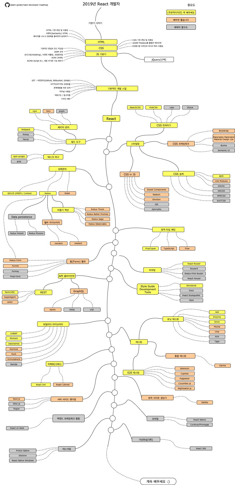

# React 개발자 로드맵

[README in Chinese](README-CN.md)

[README in English](README.md)

[README in Japanese](README-JA.md)

[README in Portuguese (Brazil)](README-PTBR.md)

[README in Russian](README-RU.md)

[README in Spanish](README-ES.md)

> 2019년 React 개발자 로드맵:

아래에는 React 개발자가 되기 위한 학습 로드맵과 관련 라이브러리들이 적혀있는 차트가 있습니다. React 개발자로서 다음에 무엇을 배워야하는지 묻는 모든 사람들을 위한 팁으로 이 차트를 만들었습니다.

## 주의사항

> 이 로드맵의 목적은 전체에 대한 윤곽을 제공하는 것입니다. 여러분이 무조건 힙하고 트렌디한 것을 선택하기보단, 앞으로 무엇을 배워야할지 혼란스러울때 이 로드맵이 좋은 가이드가 될 것입니다. 기술을 선택함에 있어 하나의 도구가 다른 도구보다 어떤 경우에 적합한지 이해해야하며, 힙하고 트렌디한 기술들이 항상 모든 업무에 적합하진 않다는 것을 염두에 두시기 바랍니다.

## 로드맵

## 학습 리소스

1. 기본기
   1. HTML
      - HTML의 기본기를 다져주세요.
      - 연습삼아 몇 개의 페이지를 만들어보세요.
   2. CSS
      - CSS의 기본기를 다져주세요.
      - 이전 단계에서 만들었던 페이지들을 꾸며보세요.
      - Grid와 flexbox를 활용해 페이지를 만들어보세요.
   3. JS 기본
      - 문법에 익숙해지세요.
      - DOM을 활용한 기본적인 작업들을 배우세요.
      - JS에 대한 일반적인 메커니즘을 배우세요. (호이스팅, 이벤트 버블링, 프로토타입)
      - AJAX (XHR) 요청을 해보세요.
      - 새로운 기능을 배우세요. (ECMA Script 6+)
      - 선택적으로, jQuery 라이브러리에 익숙해지면 좋습니다.
2. 기본적인 개발 스킬
   1. GIT에 대해 공부하고, GitHub에 몇 개의 Repository를 만들어도 보고, 다른 사람들에게 여러분의 코드를 공유해보세요.
   2. Request 메소드 (GET, POST, PUT, PATCH, DELETE, OPTIONS)와 더불어 HTTP(S) 프로토콜에 대해 공부하세요.
   3. 구글링을 겁내지 마세요. [구글로 파워서칭 해보기](http://www.powersearchingwithgoogle.com/)
   4. 터미널에 익숙해지시고, 여러분만의 shell (bash, zsh, fish)을 설정해보세요.
   5. 알고리즘과 자료구조에 대한 몇 개의 책을 읽어보세요.
   6. 디자인 패턴에 대한 몇 개의 책을 읽어보세요.
3. [공식 홈페이지](https://reactjs.org/tutorial/tutorial.html)에서 튜토리얼을 읽어보거나 몇 개의 [코스들](https://egghead.io/courses/the-beginner-s-guide-to-react)을 수강해보세요.
4. 여러분이 사용할 도구들에 익숙해지세요.
   1. 패키지 관리
      - [npm](https://www.npmjs.com/)
      - [yarn](https://yarnpkg.com/lang/en/)
      - [pnpm](https://pnpm.js.org/)
   2. 태스크 러너
      - [npm scripts](https://docs.npmjs.com/misc/scripts)
      - [gulp](https://gulpjs.com/)
   - [Webpack](https://webpack.js.org/)
   - [Rollup](https://rollupjs.org/guide/en)
   - [Parcel](https://parceljs.org/)
5. 스타일링
   1. CSS 전처리기
      - [Sass/CSS](https://sass-lang.com/)
      - [PostCSS](https://postcss.org/)
      - [Less](http://lesscss.org/)
      - [Stylus](http://stylus-lang.com/)
   2. CSS 프레임워크
      - [Bootstrap](https://getbootstrap.com/)
      - [Materialize](https://materializecss.com/), [Material UI](https://material-ui.com/), [Material Design Lite](https://getmdl.io/)
      - [Bulma](https://bulma.io/)
      - [Semantic UI](https://semantic-ui.com/)
   3. CSS 설계
      - [BEM](http://getbem.com/)
      - [CSS Modules](https://github.com/css-modules/css-modules)
      - [Atomic](https://acss.io/)
      - [OOCSS](https://github.com/stubbornella/oocss/wiki)
      - [SMACSS](https://smacss.com/)
      - [SUITCSS](https://suitcss.github.io/)
   4. CSS in JS
      - [Styled Components](https://www.styled-components.com/)
      - [Radium](https://formidable.com/open-source/radium/)
      - [Emotion](https://emotion.sh/)
      - [JSS](http://cssinjs.org/)
      - [Aphrodite](https://github.com/Khan/aphrodite)
6. 상태관리
   1. [컴포넌트 상태관리](https://reactjs.org/docs/faq-state.html)/[Context API](https://reactjs.org/docs/context.html)
   2. [Redux](https://redux.js.org/)
      1. 비동기 액션 (사이드 이펙트)
         - [Redux Thunk](https://github.com/reduxjs/redux-thunk)
         - [Redux Better Promise](https://github.com/Lukasz-pluszczewski/redux-better-promise)
         - [Redux Saga](https://redux-saga.js.org/)
         - [Redux Observable](https://redux-observable.js.org)
      2. 헬퍼 라이브러리
         - [Rematch](https://rematch.gitbooks.io/rematch/)
         - [Reselect](https://github.com/reduxjs/reselect)
      3. 데이터 지속성
         - [Redux Persist](https://github.com/rt2zz/redux-persist)
         - [Redux Phoenix](https://github.com/adam-golab/redux-phoenix)
      4. [Redux Form](https://redux-form.com)
   3. [MobX](https://mobx.js.org/)
7. 정적 타입 체킹
   - [PropTypes](https://reactjs.org/docs/typechecking-with-proptypes.html)
   - [TypeScript](https://www.typescriptlang.org/)
   - [Flow](https://flow.org/en/)
8. 폼(Form) 헬퍼
   - [Redux Form](https://redux-form.com)
   - [Formik](https://github.com/jaredpalmer/formik)
   - [Formsy](https://github.com/formsy/formsy-react)
   - [Final Form](https://github.com/final-form/final-form)
9. 라우팅
   - [React-Router](https://reacttraining.com/react-router/)
   - [Router5](https://router5.js.org/)
   - [Redux-First Router](https://github.com/faceyspacey/redux-first-router)
   - [Reach Router](https://reach.tech/router/)
10. API 클라이언트
    1. REST
       - [Fetch](https://developer.mozilla.org/en-US/docs/Web/API/Fetch_API)
       - [SuperAgent](https://visionmedia.github.io/superagent/)
       - [axios](https://github.com/axios/axios)
    2. GraphQL
       - [Apollo](https://www.apollographql.com/docs/react/)
       - [Relay](https://facebook.github.io/relay/)
       - [urql](https://github.com/FormidableLabs/urql)
11. 유틸리티 라이브러리
    - [Lodash](https://lodash.com/)
    - [Moment](https://momentjs.com/)
    - [classnames](https://github.com/JedWatson/classnames)
    - [Numeral](http://numeraljs.com/)
    - [RxJS](http://reactivex.io/)
    - [ImmutableJS](https://facebook.github.io/immutable-js/)
    - [Ramda](https://ramdajs.com/)
12. 테스팅
    1. 유닛 테스팅
       - [Jest](https://facebook.github.io/jest/)
       - [Enzyme](http://airbnb.io/enzyme/)
       - [Sinon](http://sinonjs.org/)
       - [Mocha](https://mochajs.org/)
       - [Chai](http://www.chaijs.com/)
       - [AVA](https://github.com/avajs/ava)
       - [Tape](https://github.com/substack/tape)
    2. End to End 테스팅
       - [Selenium](https://www.seleniumhq.org/), [Webdriver](http://webdriver.io/)
       - [Cypress](https://cypress.io/)
       - [Puppeteer](https://pptr.dev/)
       - [Cucumber.js](https://github.com/cucumber/cucumber-js)
       - [Nightwatch.js](http://nightwatchjs.org/)
    3. 통합 테스팅
       - [Karma](https://karma-runner.github.io/)
13. 국제화
    - [React Intl](https://github.com/yahoo/react-intl)
    - [React i18next](https://react.i18next.com/)
14. 서버사이드 렌더링
    - [Next.js](https://nextjs.org/)
    - [After.js](https://github.com/jaredpalmer/after.js)
    - [Rogue](https://github.com/alidcastano/rogue.js)
15. 정적 사이트 생성기
    - [Gatsby](https://www.gatsbyjs.org/)
16. 백엔드 프레임워크 통합
    - [React on Rails](https://shakacode.gitbooks.io/react-on-rails/content/)
17. 모바일
    - [React Native](https://facebook.github.io/react-native/)
    - [Cordova](https://cordova.apache.org/)/[Phonegap](https://phonegap.com/)
18. 데스크탑
    - [Proton Native](https://proton-native.js.org/)
    - [Electron](https://electronjs.org/)
    - [React Native Windows](https://github.com/Microsoft/react-native-windows)
19. 가상현실 (VR)
    - [React 360](https://facebook.github.io/react-360/)

## 마무리

이 로드맵에 개선이 필요하면 수정사항을 포함한 PR을 보내주시거나 이슈에 의견을 남겨주세요. 저 또한 이것을 계속 개선하려고 노력 중에 있으니, 여러분께서도 다시 찾아오시기 쉽도록 Star을 부탁드립니다.

## 컨트리뷰션

이 로드맵은 [Draw.io](https://www.draw.io/)를 사용하여 작성되었습니다. 프로젝트 파일들은 `/src` 디렉토리에 있습니다. 수정하기 위해선 draw.io를 열어서, **Open Existing Diagram** 를 누르시고 프로젝트 내의 `xml` 파일을 선택해주세요. 로드맵 파일이 열릴 것입니다. 수정하시고, readme의 image 파일을 변경해주시고 PR을 만들어주세요. (png 파일로 내보내기 해주세요).

- 수정 / 개선사항과 함께 Pull Request를 남겨주세요.
- Issues에서 의견을 나눠주세요.
- 다른 사람들에게도 알려주세요.

## 라이센스

