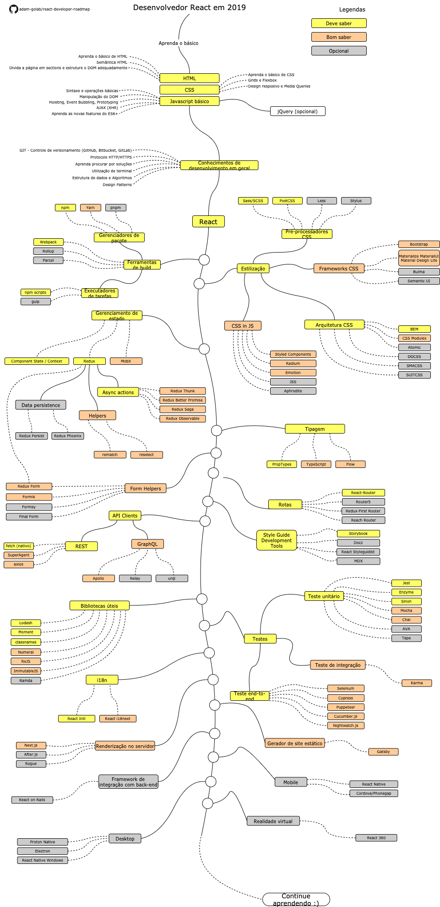

# Guia do desenvolvedor React

[README in Chinese](README-CN.md)

[README in English](README.md)

[README in Japanese](README-JA.md)

[README in Russian](README-RU.md)

[README in Spanish](README-ES.md)

> Guia para se tornar um desenvolvedor React em 2019:
> Abaixo, você pode encontrar um diagrama mostrando os caminhos que podem levar, bem como as bibliotecas que você precisa aprender para se tornar um desenvolvedor React. Eu fiz esse esquema como uma dica para qualquer um que me perguntasse: "O que eu deveria aprender mais como desenvolvedor React?"

## Aviso

> O objetivo deste guia é dar uma ideia geral de como se tornar um desenvolvedor React. Este guia irá ajudá-lo se você estiver confuso sobre o que estudar, em vez de encorajá-lo a escolher algo elegante e popular. Você deve entender gradualmente por que uma ferramenta é mais adequada para determinadas situações do que outra, e não se esqueça de que uma ferramenta moderna e popular nem sempre significa que ela é mais adequada para o trabalho.

## Roadmap

## Recursos

1. Basico
   1. HTML
      - Aprenda o básico do HTML
      - Desenvolva algumas paginas como exercícios
   2. CSS
      - Aprenda o básico de CSS
      - Aplique estilos nas páginas desenvolvidas anteriormente
      - Desenvolva uma página com CSS Grid e CSS Flexbox
   3. Javascript
      - Se familiarize com a sintaxe
      - Aprenda operações basicas com o DOM
      - Aprenda mecanismos típicos para JS (Hoisting, Event Bubbling, Prototyping)
      - Faça algumas requisições AJAX
      - Aprenda as novas features do javascript (ECMA Script 6+)
      - Opcional: Conheça a biblioteca JQuery
2. Conhecimentos de desenvolvimento em geral
   1. Aprenda GIT, crie repositórios no GitHub e compartilhe seu código com outras pessoas.
   2. Aprenda os protocolos HTTP(S) e metodos de request (GET, POST, PUT, PATCH, DELETE, OPTIONS)
   3. Não tenha medo de utilizar o google, veja [o uso avançado do Google](http://www.powersearchingwithgoogle.com/)
   4. Familiarize-se com terminal e configure-o (bash, zsh, fish)
   5. Leia alguns livros sobre algoritmos e estrutura de dados
   6. Leia alguns livros sobre padrões de projeto (design patterns)
3. Aprenda React no [site oficial](https://reactjs.org/tutorial/tutorial.html) ou realize alguns [cursos](https://egghead.io/courses/the-beginner-s-guide-to-react)
4. Conheça as ferramentas que voce usará
   1. Gerenciadores de pacote
      - [npm](https://www.npmjs.com/)
      - [yarn](https://yarnpkg.com/lang/en/)
      - [pnpm](https://pnpm.js.org/)
   2. Executadores de tarefas
      - [npm scripts](https://docs.npmjs.com/misc/scripts)
      - [gulp](https://gulpjs.com/)
   - [Webpack](https://webpack.js.org/)
   - [Rollup](https://rollupjs.org/guide/en)
   - [Parcel](https://parceljs.org/)
5. Estilização
   1. Pré-processadores CSS
      - [Sass/CSS](https://sass-lang.com/)
      - [PostCSS](https://postcss.org/)
      - [Less](http://lesscss.org/)
      - [Stylus](http://stylus-lang.com/)
   2. Frameworks CSS
      - [Bootstrap](https://getbootstrap.com/)
      - [Materialize](https://materializecss.com/), [Material UI](https://material-ui.com/), [Material Design Lite](https://getmdl.io/)
      - [Bulma](https://bulma.io/)
      - [Semantic UI](https://semantic-ui.com/)
   3. Arquitetura CSS
      - [BEM](http://getbem.com/)
      - [CSS Modules](https://github.com/css-modules/css-modules)
      - [Atomic](https://acss.io/)
      - [OOCSS](https://github.com/stubbornella/oocss/wiki)
      - [SMACSS](https://smacss.com/)
      - [SUITCSS](https://suitcss.github.io/)
   4. CSS in JS
      - [Styled Components](https://www.styled-components.com/)
      - [Radium](https://formidable.com/open-source/radium/)
      - [Emotion](https://emotion.sh/)
      - [JSS](http://cssinjs.org/)
      - [Aphrodite](https://github.com/Khan/aphrodite)
6. Gerenciamento de estado
   1. [Component State](https://reactjs.org/docs/faq-state.html)/[Context API](https://reactjs.org/docs/context.html)
   2. [Redux](https://redux.js.org/)
      1. Async actions (Side Effects)
         - [Redux Thunk](https://github.com/reduxjs/redux-thunk)
         - [Redux Better Promise](https://github.com/Lukasz-pluszczewski/redux-better-promise)
         - [Redux Saga](https://redux-saga.js.org/)
         - [Redux Observable](https://redux-observable.js.org)
      2. Helpers
         - [Rematch](https://rematch.gitbooks.io/rematch/)
         - [Reselect](https://github.com/reduxjs/reselect)
      3. Persistencia de dados
         - [Redux Persist](https://github.com/rt2zz/redux-persist)
         - [Redux Phoenix](https://github.com/adam-golab/redux-phoenix)
      4. [Redux Form](https://redux-form.com)
   3. [MobX](https://mobx.js.org/)
7. Tipagem
   - [PropTypes](https://reactjs.org/docs/typechecking-with-proptypes.html)
   - [TypeScript](https://www.typescriptlang.org/)
   - [Flow](https://flow.org/en/)
8. Form Helpers
   - [Redux Form](https://redux-form.com)
   - [Formik](https://github.com/jaredpalmer/formik)
   - [Formsy](https://github.com/formsy/formsy-react)
   - [Final Form](https://github.com/final-form/final-form)
9. Rotas
   - [React-Router](https://reacttraining.com/react-router/)
   - [Router5](https://router5.js.org/)
   - [Redux-First Router](https://github.com/faceyspacey/redux-first-router)
   - [Reach Router](https://reach.tech/router/)
10. Clientes API
    1. REST
       - [Fetch](https://developer.mozilla.org/en-US/docs/Web/API/Fetch_API)
       - [SuperAgent](https://visionmedia.github.io/superagent/)
       - [axios](https://github.com/axios/axios)
    2. GraphQL
       - [Apollo](https://www.apollographql.com/docs/react/)
       - [Relay](https://facebook.github.io/relay/)
       - [urql](https://github.com/FormidableLabs/urql)
11. Bibliotecas uteis
    - [Lodash](https://lodash.com/)
    - [Moment](https://momentjs.com/)
    - [classnames](https://github.com/JedWatson/classnames)
    - [Numeral](http://numeraljs.com/)
    - [RxJS](http://reactivex.io/)
    - [ImmutableJS](https://facebook.github.io/immutable-js/)
    - [Ramda](https://ramdajs.com/)
12. Testes
    1. Teste unitário
       - [Jest](https://facebook.github.io/jest/)
       - [Enzyme](http://airbnb.io/enzyme/)
       - [Sinon](http://sinonjs.org/)
       - [Mocha](https://mochajs.org/)
       - [Chai](http://www.chaijs.com/)
       - [AVA](https://github.com/avajs/ava)
       - [Tape](https://github.com/substack/tape)
    2. Teste end-to-end
       - [Selenium](https://www.seleniumhq.org/), [Webdriver](http://webdriver.io/)
       - [Cypress](https://cypress.io/)
       - [Puppeteer](https://pptr.dev/)
       - [Cucumber.js](https://github.com/cucumber/cucumber-js)
       - [Nightwatch.js](http://nightwatchjs.org/)
    3. Teste de integração
       - [Karma](https://karma-runner.github.io/)
13. Internacionalização
    - [React Intl](https://github.com/yahoo/react-intl)
    - [React i18next](https://react.i18next.com/)
14. Renderização no servidor
    - [Next.js](https://nextjs.org/)
    - [After.js](https://github.com/jaredpalmer/after.js)
    - [Rogue](https://github.com/alidcastano/rogue.js)
15. Gerador de site estático
    - [Gatsby](https://www.gatsbyjs.org/)
16. Integração com estrturas de backend
    - [React on Rails](https://shakacode.gitbooks.io/react-on-rails/content/)
17. Desenvolvimento de aplicativos móveis
    - [React Native](https://facebook.github.io/react-native/)
    - [Cordova](https://cordova.apache.org/)/[Phonegap](https://phonegap.com/)
18. Desenvolvimento de aplicativos desktop
    - [Proton Native](https://proton-native.js.org/)
    - [Electron](https://electronjs.org/)
    - [React Native Windows](https://github.com/Microsoft/react-native-windows)
19. Realidade virtual
    - [React 360](https://facebook.github.io/react-360/)

## Resumo

Se você acha que o guia pode ser melhorado, envie um PR com quaisquer atualizações e envie suas dúvidas. Além disso, continuarei a melhorar este repositório, então, favorite esse repositório para sempre revisitar.

## Contribuição

O guia foi criado com a ferramenta online [Draw.io](https://www.draw.io/). O arquivo do projeto pode ser encontrado no diretório `/src`. Para alterá-lo, abra o draw.io, clique em **Open Existing Diagram** e selecione o arquivo `xml`. Ele irá abrir o guia. Atualize o guia, faça update das imagens no readme (exporte como png) e crie um PR.

- Abra pull request com melhorias
- Discuta novas ideias nas issues
- Compartilhe esse repositorio

## Licença

