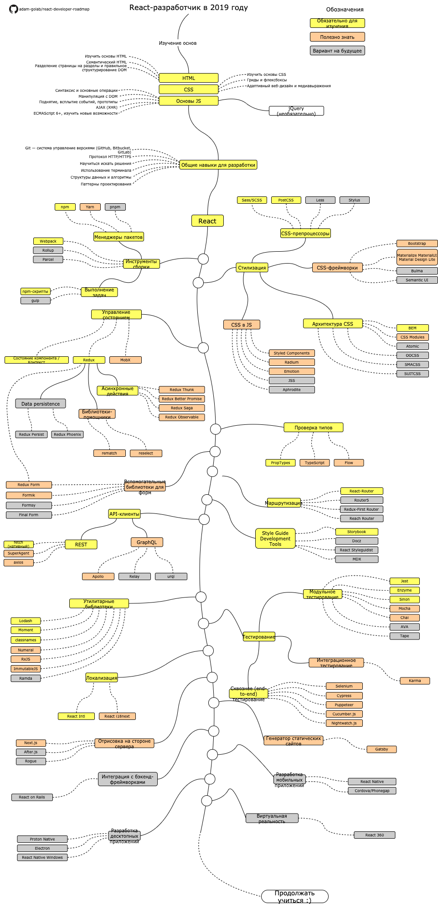

# План становления React-разработчиком

[README in Chinese](README-CN.md)

[README in English](README.md)

[README in Japanese](README-JA.md)

[README in Korean](README-KO.md)

[README in Portuguese (Brazil)](README-PTBR.md)

[README in Spanish](README-ES.md)

> План, чтобы стать React-разработчиком в 2019 году:

Ниже вы можете найти схему, показывающую пути, которые могут привести, а также библиотеки, которые вам нужно изучить, чтобы стать разработчиком React. Я сделал эту схему в качестве подсказки для всех, кто спрашивает меня: «Что мне стоит изучить ещё в качестве React-разработчика?»

## Предупреждение

> Цель этого плана — дать вам общее представление о том, как стать React-разработчиком. Этот план поможет вам, если вы запутались, что изучать дальше, вместо того, чтобы поощрять вас выбирать что-то модное и популярное. Вам стоит постепенно понимать, почему один инструмент лучше подходит для определённых ситуаций, чем другой, и не забывать, что модный и популярный инструмент не всегда означает, что он лучше всего подходит для работы.

## План изучения

## Ресурсы

1. Основы
    1. HTML
        * Изучить основы HTML
        * Сделать несколько страниц в качестве упражнения
    2. CSS
        * Изучить основы CSS
        * Стилизовать страницы, созданные в предыдущем шаге
        * Создать страницу с использованием сеток и флексбокса
    3. Основы JS
        * Познакомиться с синтаксисом
        * Изучить основные операции на DOM
        * Изучить механизмы, специфичные для JS (Поднятие, всплытие событий, прототипное наследование)
        * Выполнить некоторые AJAX-вызовы (XHR)
        * Изучить новые возможности (ECMAScript 6+)
        * Дополнительно познакомиться с библиотекой jQuery
2. Общие навыки для разработки
    1. Изучить Git, создать несколько репозиториев на GitHub, поделиться своим кодом с другими
    2. Узнать о протоколе HTTP(S), методами запроса (GET, POST, PUT, PATCH, DELETE, OPTIONS)
    3. Не бояться использовать Google, посмотреть [курс по продвинутому использованию Google](http://www.powersearchingwithgoogle.com/)
    4. Познакомиться с терминалом, настроить оболочку (bash, zsh, fish)
    5. Прочитать несколько книг про алгоритмы и структуры данных
    6. Прочитать несколько книг по паттернам проектирования
3. Изучить [официальный сайт React](https://reactjs.org/tutorial/tutorial.html), пройти [курсы](https://egghead.io/courses/the-beginner-s-guide-to-react) или прочитать [книги](https://github.com/EbookFoundation/free-programming-books/blob/master/free-programming-books-ru.md#react)
4. Познакомиться с инструментами, которые вы будете использовать
    1. Менеджеры пакетов
        * [npm](https://www.npmjs.com/)
        * [yarn](https://yarnpkg.com/lang/en/)
        * [pnpm](https://pnpm.js.org/)
    2. Выполнение задач
        * [npm-скрипты](https://docs.npmjs.com/misc/scripts)
        * [gulp](https://gulpjs.com/)
    * [Webpack](https://webpack.js.org/)
    * [Rollup](https://rollupjs.org/guide/en)
    * [Parcel](https://parceljs.org/)
5. Стилизация
    1. CSS-препроцессоры
        * [Sass/CSS](https://sass-lang.com/)
        * [PostCSS](https://postcss.org/)
        * [Less](http://lesscss.org/)
        * [Stylus](http://stylus-lang.com/)
    2. CSS-фреймворки
        * [Bootstrap](https://getbootstrap.com/)
        * [Materialize](https://materializecss.com/), [Material UI](https://material-ui.com/), [Material Design Lite](https://getmdl.io/)
        * [Bulma](https://bulma.io/)
        * [Semantic UI](https://semantic-ui.com/)
    3. Архитектура CSS
        * [BEM](http://getbem.com/)
        * [CSS Modules](https://github.com/css-modules/css-modules)
        * [Atomic](https://acss.io/)
        * [OOCSS](https://github.com/stubbornella/oocss/wiki)
        * [SMACSS](https://smacss.com/)
        * [SUITCSS](https://suitcss.github.io/)
    4. CSS в JS
        * [Styled Components](https://www.styled-components.com/)
        * [Radium](https://formidable.com/open-source/radium/)
        * [Emotion](https://emotion.sh/)
        * [JSS](http://cssinjs.org/)
        * [Aphrodite](https://github.com/Khan/aphrodite)
6. Управление состоянием
    1. [Состояние компонента](https://reactjs.org/docs/faq-state.html)/[Context API](https://reactjs.org/docs/context.html)
    2. [Redux](https://redux.js.org/)
        1. Асинхронные действия (побочные эффекты)
            * [Redux Thunk](https://github.com/reduxjs/redux-thunk)
            * [Redux Better Promise](https://github.com/Lukasz-pluszczewski/redux-better-promise)
            * [Redux Saga](https://redux-saga.js.org/)
            * [Redux Observable](https://redux-observable.js.org)
        2. Библиотеки-помощники
            * [Rematch](https://rematch.gitbooks.io/rematch/)
            * [Reselect](https://github.com/reduxjs/reselect)
        3. Постоянное хранение данных
            * [Redux Persist](https://github.com/rt2zz/redux-persist)
            * [Redux Phoenix](https://github.com/adam-golab/redux-phoenix)
        4. [Redux Form](https://redux-form.com)
    3. [MobX](https://mobx.js.org/)
7. Проверка типов
    * [PropTypes](https://reactjs.org/docs/typechecking-with-proptypes.html)
    * [TypeScript](https://www.typescriptlang.org/)
    * [Flow](https://flow.org/en/)
8. Вспомогательные библиотеки для форм
    * [Redux Form](https://redux-form.com)
    * [Formik](https://github.com/jaredpalmer/formik)
    * [Formsy](https://github.com/formsy/formsy-react)
    * [Final Form](https://github.com/final-form/final-form)
9. Маршрутизация
    * [React-Router](https://reacttraining.com/react-router/)
    * [Router5](https://router5.js.org/)
    * [Redux-First Router](https://github.com/faceyspacey/redux-first-router)
    * [Reach Router](https://reach.tech/router/)
10. API-клиенты
    1. REST
        * [Fetch](https://developer.mozilla.org/en-US/docs/Web/API/Fetch_API)
        * [SuperAgent](https://visionmedia.github.io/superagent/)
        * [axios](https://github.com/axios/axios)
    2. GraphQL
        * [Apollo](https://www.apollographql.com/docs/react/)
        * [Relay](https://facebook.github.io/relay/)
        * [urql](https://github.com/FormidableLabs/urql)
11. Утилитарные библиотеки
    * [Lodash](https://lodash.com/)
    * [Moment](https://momentjs.com/)
    * [classnames](https://github.com/JedWatson/classnames)
    * [Numeral](http://numeraljs.com/)
    * [RxJS](http://reactivex.io/)
    * [ImmutableJS](https://facebook.github.io/immutable-js/)
    * [Ramda](https://ramdajs.com/)
12. Тестирование
    1. Модульное тестирование
        * [Jest](https://facebook.github.io/jest/)
        * [Enzyme](http://airbnb.io/enzyme/)
        * [Sinon](http://sinonjs.org/)
        * [Mocha](https://mochajs.org/)
        * [Chai](http://www.chaijs.com/)
        * [AVA](https://github.com/avajs/ava)
        * [Tape](https://github.com/substack/tape)
    2. Сквозное (end-to-end) тестирование
        * [Selenium](https://www.seleniumhq.org/), [Webdriver](http://webdriver.io/)
        * [Cypress](https://cypress.io/)
        * [Puppeteer](https://pptr.dev/)
        * [Cucumber.js](https://github.com/cucumber/cucumber-js)
        * [Nightwatch.js](http://nightwatchjs.org/)
    3. Интеграционное тестирование
        * [Karma](https://karma-runner.github.io/)
13. Локализация
    * [React Intl](https://github.com/yahoo/react-intl)
    * [React i18next](https://react.i18next.com/)
14. Отрисовка на стороне сервера
    * [Next.js](https://nextjs.org/)
    * [After.js](https://github.com/jaredpalmer/after.js)
    * [Rogue](https://github.com/alidcastano/rogue.js)
15. Генератор статических сайтов
    * [Gatsby](https://www.gatsbyjs.org/)
16. Интеграция с бэкенд-фреймворками
    * [React on Rails](https://shakacode.gitbooks.io/react-on-rails/content/)
17. Разработка мобильных приложений
    * [React Native](https://facebook.github.io/react-native/)
    * [Cordova](https://cordova.apache.org/)/[Phonegap](https://phonegap.com/)
18. Разработка десктопных приложений
    * [Proton Native](https://proton-native.js.org/)
    * [Electron](https://electronjs.org/)
    * [React Native Windows](https://github.com/Microsoft/react-native-windows)
19. Виртуальная реальность
    * [React 360](https://facebook.github.io/react-360/)

## Резюме

Если вы считаете, что план может быть улучшен, пожалуйста, создайте пулреквест с любыми обновлениями и отправляйте любые ишью, если есть вопросы и предложения. Кроме того, я продолжу улучшать его, так что, возможно, стоит отслеживать изменения, происходящие в этом репозитории, либо заглянуть в него спустя некоторое время.

## Участие в проекте

План создан с помощью онлайн-инструмента [Draw.io](https://www.draw.io/). Файл проекта можно найти в каталоге `/src`. Чтобы изменить его, откройте draw.io, нажмите **Open Existing Diagram** и выберите файл `xml` с проектом. Он откроет схему, обновите её, загрузите и обновите изображения в readme и создайте PR (экспортируйте как png).

- Открыть пулреквест с улучшениями
- Обсуждайте новые идеи в ишью
- Расскажите об этом другим

## Лицензия

