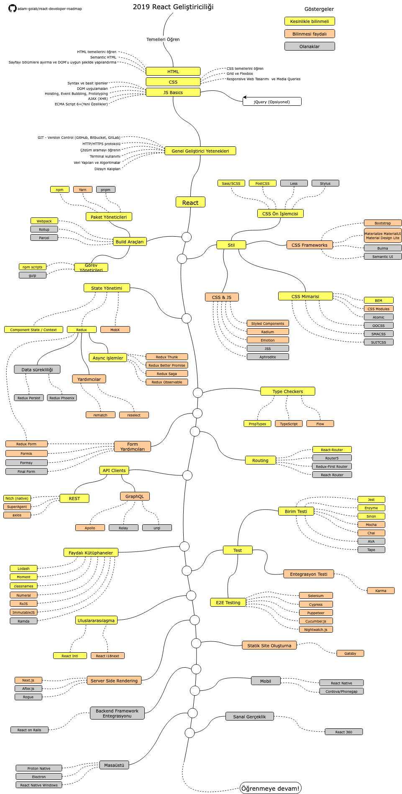

# React Developer Yol Haritası

[README in Chinese](README-CN.md)

[README in Japanese](README-JA.md)

[README in Korean](README-KO.md)

[README in Portuguese (Brazil)](README-PTBR.md)

[README in Russian](README-RU.md)

[README in Spanish](README-ES.md)

[README in Turkish]

> 2019'da React geliştiricisi olmaya giden yol haritası:

Aşağıda, React geliştiricisi olmak için izleyebileceğiniz yolları ve öğrenmek isteyeceğiniz kütüphaneleri gösteren bir tablo bulabilirsiniz. Bu çizelgeyi, "Bir React geliştiricisi olarak bundan sonra ne öğrenmeliyim?" diye soran herkes için bir ipucu olarak hazırladım.

## Feragatname
> Bu yol haritasının amacı size güzergah  hakkında  fikir vermektir. Bir sonraki adımda ne öğreneceğiniz konusunda kafanız karıştıysa, yol haritası sizi popüler ve moda olanı seçmenize teşvik etmek yerine size rehberlik edecektir. Bir aracın neden bazı durumlar için diğerinden daha uygun olduğunu kabullenmelisiniz ve unutmayın ki havalı ya da trend olan, projeniz için her zaman en uygun anlamına gelmeyebilir.
## Yol Haritası

## Kaynaklar

1. Temeller
    1. HTML
        * HTML temellerini öğren.
        * Birkaç sayfa hazırlayarak egzersiz yap.
    2. CSS
        * CSS temellerini öğren.
        * Daha önce hazırladığın sayfalarda CSS özelliklerini kullanarak egzersiz yap.
        * Grid ve Flexbox kullanarak sayfalar hazırla.
    3. JS Temelleri
        * Syntax'a aşina ol.
        * DOM temellerini öğren.
        * Tipik JS mekanizmalarını öğren. (Hoisting, Event Bubbling, Prototyping)
        * AJAX(HXR) çağrıları yap.
        * Yenilikleri öğren. (ECMA Script 6+)
        * Ek olarak JQuery kütüphanesine göz atabilirsin.
2. Genel Geliştirme Becerileri
    1. GIT öğren, birkaç repo oluştur ve kodlarını paylaş.
    2. HTTP(S) protokolünü ve request metodlarını öğren.(GET, POST, PUT, PATCH, DELETE, OPTIONS)
    3. Google kullanmaktan çekinme
    4. Terminal ekranına aşina olun, konsolunuzu konfügre edin.(bash, zsh, fish)
    5. Algoritmalar ve veri yapıları hakkında kitap okuyun.  
    6. Tasarım kalıpları hakkında kitap okuyun.
3.[Resmi websitesi](https://reactjs.org/tutorial/tutorial.html)  üzerinden ya da [kurslar](https://egghead.io/courses/the-beginner-s-guide-to-react) yardımı ile React öğrenin.
4. Kullanacağınız araçları öğrenin.
    1. Paket Yöneticileri
        * [npm](https://www.npmjs.com/)
        * [yarn](https://yarnpkg.com/lang/en/)
        * [pnpm](https://pnpm.js.org/)
    2. Görev Yöneticileri
        * [npm scripts](https://docs.npmjs.com/misc/scripts)
        * [gulp](https://gulpjs.com/)
    * [Webpack](https://webpack.js.org/)
    * [Rollup](https://rollupjs.org/guide/en)
    * [Parcel](https://parceljs.org/)
5. Stil Özellikleri
    1. CSS Ön İşlemcisi
        * [Sass/CSS](https://sass-lang.com/)
        * [PostCSS](https://postcss.org/)
        * [Less](http://lesscss.org/)
        * [Stylus](http://stylus-lang.com/)
    2. CSS Frameworks
        * [Bootstrap](https://getbootstrap.com/)
        * [Materialize](https://materializecss.com/), [Material UI](https://material-ui.com/), [Material Design Lite](https://getmdl.io/)
        * [Bulma](https://bulma.io/)
        * [Semantic UI](https://semantic-ui.com/)
    3. CSS Mimarisi
        * [BEM](http://getbem.com/)
        * [CSS Modules](https://github.com/css-modules/css-modules)
        * [Atomic](https://acss.io/)
        * [OOCSS](https://github.com/stubbornella/oocss/wiki)
        * [SMACSS](https://smacss.com/)
        * [SUITCSS](https://suitcss.github.io/)
    4. JS içerisinde CSS
        * [Styled Components](https://www.styled-components.com/)
        * [Radium](https://formidable.com/open-source/radium/)
        * [Emotion](https://emotion.sh/)
        * [JSS](http://cssinjs.org/)
        * [Aphrodite](https://github.com/Khan/aphrodite)
6. State Yönetimi
    1. [Component State](https://reactjs.org/docs/faq-state.html)/[Context API](https://reactjs.org/docs/context.html)
    2. [Redux](https://redux.js.org/)
        1. Async eylemler
            * [Redux Thunk](https://github.com/reduxjs/redux-thunk)
            * [Redux Better Promise](https://github.com/Lukasz-pluszczewski/redux-better-promise)
            * [Redux Saga](https://redux-saga.js.org/)
            * [Redux Observable](https://redux-observable.js.org)
        2. Yardımcılar
            * [Rematch](https://rematch.gitbooks.io/rematch/)
            * [Reselect](https://github.com/reduxjs/reselect)
        3. Data Sürekliliği
            * [Redux Persist](https://github.com/rt2zz/redux-persist)
            * [Redux Phoenix](https://github.com/adam-golab/redux-phoenix)
        4. [Redux Form](https://redux-form.com)
    3. [MobX](https://mobx.js.org/)
7. Type Kontrol
    * [PropTypes](https://reactjs.org/docs/typechecking-with-proptypes.html)
    * [TypeScript](https://www.typescriptlang.org/)
    * [Flow](https://flow.org/en/)
8. Form Yardımcıları
    * [Redux Form](https://redux-form.com)
    * [Formik](https://github.com/jaredpalmer/formik)
    * [Formsy](https://github.com/formsy/formsy-react)
    * [Final Form](https://github.com/final-form/final-form)
9. Routing
    * [React-Router](https://reacttraining.com/react-router/)
    * [Router5](https://router5.js.org/)
    * [Redux-First Router](https://github.com/faceyspacey/redux-first-router)
    * [Reach Router](https://reach.tech/router/)
10. API İstemcileri
    1. REST
        * [Fetch](https://developer.mozilla.org/en-US/docs/Web/API/Fetch_API)
        * [SuperAgent](https://visionmedia.github.io/superagent/)
        * [axios](https://github.com/axios/axios)
    2. GraphQL
        * [Apollo](https://www.apollographql.com/docs/react/)
        * [Relay](https://facebook.github.io/relay/)
        * [urql](https://github.com/FormidableLabs/urql)
12. Faydalı Kütüphaeler
    * [Lodash](https://lodash.com/)
    * [Moment](https://momentjs.com/)
    * [classnames](https://github.com/JedWatson/classnames)
    * [Numeral](http://numeraljs.com/)
    * [RxJS](http://reactivex.io/)
    * [ImmutableJS](https://facebook.github.io/immutable-js/)
    * [Ramda](https://ramdajs.com/)
13. Test
    1. Unit Test
        * [Jest](https://facebook.github.io/jest/)
        * [Enzyme](http://airbnb.io/enzyme/)
        * [Sinon](http://sinonjs.org/)
        * [Mocha](https://mochajs.org/)
        * [Chai](http://www.chaijs.com/)
        * [AVA](https://github.com/avajs/ava)
        * [Tape](https://github.com/substack/tape)
    2. Uçtan Uca Test
        * [Selenium](https://www.seleniumhq.org/), [Webdriver](http://webdriver.io/)
        * [Cypress](https://cypress.io/)
        * [Puppeteer](https://pptr.dev/)
        * [Cucumber.js](https://github.com/cucumber/cucumber-js)
        * [Nightwatch.js](http://nightwatchjs.org/)
    3. Entegrasyon Testi
        * [Karma](https://karma-runner.github.io/)
14. Uluslararasılaşma
    * [React Intl](https://github.com/yahoo/react-intl)
    * [React i18next](https://react.i18next.com/)
15. Server Side Rendering
    * [Next.js](https://nextjs.org/)
    * [After.js](https://github.com/jaredpalmer/after.js)
    * [Rogue](https://github.com/alidcastano/rogue.js)
16.Statik Site Oluşturucu
    * [Gatsby](https://www.gatsbyjs.org/)
17. Backend Framework Entegrasyonu
    * [React on Rails](https://shakacode.gitbooks.io/react-on-rails/content/)
18. Mobil
    * [React Native](https://facebook.github.io/react-native/)
    * [Cordova](https://cordova.apache.org/)/[Phonegap](https://phonegap.com/)
19. Masaüstü
    * [Proton Native](https://proton-native.js.org/)
    * [Electron](https://electronjs.org/)
    * [React Native Windows](https://github.com/Microsoft/react-native-windows)
20. Sanal Gerçeklik
    * [React 360](https://facebook.github.io/react-360/)

## Yazar Notu

Yol haritasını iyileştirebileceğinizi düşünüyorsanız, lütfen bir PR oluşturun ve bizimle paylaşın. Ayrıca bu yol haritasını geliştirmeye devam edeceğim, favorilerinize ekleyerek güncellemeleri takip edebilirsiniz.

## Contribution

The roadmap is built using [Draw.io](https://www.draw.io/). Project file can be found at `/src` directory. To modify it, open draw.io, click **Open Existing Diagram** and choose `xml` file with project. It will open the roadmap for you. Update it, upload and update the images in readme and create a PR (export as png).

- Open a pull request with improvements
- Discuss ideas in issues
- Spread the word

## Lisans

